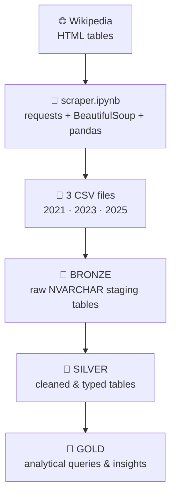

# 📊 Wiki Tech Revenue Pipeline


An end-to-end data pipeline that scrapes historical revenue data for the world's
largest technology companies from Wikipedia, loads it into a SQL Server
warehouse using a **Bronze → Silver → Gold** medallion architecture, and runs
analytical queries on top of the cleaned data.

---

## 🧭 Overview

This project pulls three revenue tables from Wikipedia's
[*List of largest technology companies by revenue*](https://en.wikipedia.org/wiki/List_of_largest_technology_companies_by_revenue) —
covering **2021, 2023, and 2025** — using Python and BeautifulSoup, loads the
raw data into SQL Server, cleans and standardizes it, and answers questions
like:

- Which companies stayed in the top list across all three years?
- How is revenue distributed by headquarters country?
- What's the combined and average revenue each year?

---

## 🔄 Pipeline Flow



| Stage | What happens |
|:--|:--|
| 🌐 **Source** | Wikipedia's tech-revenue tables, one per year |
| 🐍 **Extraction** | `scraper.ipynb` scrapes and exports 3 CSVs |
| 🥉 **Bronze** | Raw load into SQL Server, no cleaning yet |
| 🥈 **Silver** | Trimmed, typed, cast into proper `DECIMAL`/`INT` |
| 🥇 **Gold** | Cross-year analysis: top companies, country breakdowns, revenue totals |

---

## ⚙️ What Each Layer Does

### 🐍 1. Extraction — `scraper.ipynb`
- Sends an identified `GET` request (proper `User-Agent`) to the Wikipedia page
- Parses the HTML with BeautifulSoup and locates the 3 revenue tables
- Builds a pandas DataFrame per table, matching scraped headers to columns
- Exports each to its own CSV:
  - `tech_acompany_info.csv` → 2025 data
  - `tech_company_info2.csv` → 2023 data
  - `tech_company_info3.csv` → 2021 data

### 🥉 2. Bronze Layer — `sql/01_init_database.sql` · `sql/02_bronze_load.sql`
- Creates the `Warehouse` database and `bronze` / `silver` / `gold` schemas
- Creates one raw staging table per CSV, all columns as `NVARCHAR`
- `BULK INSERT`s each CSV straight into its bronze table

### 🥈 3. Silver Layer — `sql/03_silver_tables.sql` · `sql/04_silver_load.sql`
- Creates typed tables (`DECIMAL` for revenue/profit, `INT` for employees)
- Cleans and casts the raw bronze data:
  - Trims whitespace from company names
  - Strips `$` before casting revenue/profit to `DECIMAL`
  - Strips quotes and commas before casting employee counts to `INT`
  - Uses `TRY_CAST` so one bad row can't fail the whole load

### 🥇 4. Gold Layer / Analysis — `sql/05_gold_analysis.sql` · `sql/06_total_revenue_by_company.sql`
- Companies present in the top list **every** year (2021, 2023, 2025)
- Count of top companies per country, per year
- Combined & average revenue across all companies, per year
- Total revenue per company, combined across years

---

## 🛠️ Tools Used

| Tool | Purpose |
|:--|:--|
| 🐍 Python | Core scripting language for the scraper |
| 🍜 BeautifulSoup | HTML parsing / table extraction |
| 🌐 requests | Fetching the Wikipedia page |
| 🐼 pandas | Building DataFrames, exporting to CSV |
| 🗄️ SQL Server (T-SQL) | Warehouse, transformations, analysis |
| 📄 CSV | Hand-off format between scraper and warehouse |

---

## 📁 Project Structure

```
wiki-tech-revenue-pipeline/
│
├── scraper.ipynb                        # Extraction: scrapes Wikipedia → 3 CSVs
│
├── sql/
│   ├── 01_init_database.sql             # Creates Warehouse DB + schemas
│   ├── 02_bronze_load.sql               # Bronze tables + BULK INSERT
│   ├── 03_silver_tables.sql             # Typed silver tables
│   ├── 04_silver_load.sql               # Cleans + casts bronze → silver
│   ├── 05_gold_analysis.sql             # Cross-year analytical queries
│   └── 06_total_revenue_by_company.sql  # Combined total revenue per company
│
└── README.md
```

---

## ▶️ How to Run

1. **Scrape the data** — run all cells in `scraper.ipynb`. Produces 3 CSVs.
2. **Set up the warehouse** — run `sql/01_init_database.sql`.
3. **Load Bronze** — update file paths in `sql/02_bronze_load.sql`, then run it.
4. **Build Silver** — run `sql/03_silver_tables.sql`, then `sql/04_silver_load.sql`.
5. **Run the analysis** — run `sql/05_gold_analysis.sql` and
   `sql/06_total_revenue_by_company.sql`.

---

## ⚠️ Known Issues / Notes

- **Hardcoded file paths** in `02_bronze_load.sql` (e.g. `F:\python pandas\...`)
  — update these for your own machine.
- **`06_total_revenue_by_company.sql`** currently unions `2023` data twice
  instead of including `2025` — flagged in the file's comments.
- **Table naming**: bronze/silver tables (`co_info`, `co_info1`, `co_info2`)
  aren't self-descriptive of their year — could rename to match the silver
  layer's `_2021` / `_2023` / `_2025` convention.
- **Wikipedia table indices** (`table[1]`, `table[2]`, `table[3]`) depend on
  the page's current layout and may need updating if it changes.

---

## 🧠 Skills Demonstrated

- Web scraping with BeautifulSoup and requests
- Extracting unstructured HTML tables into pandas DataFrames
- Medallion architecture (Bronze / Silver / Gold) warehouse design
- SQL Server: schema design, `BULK INSERT`, `TRY_CAST`, data cleaning
- Window functions, CTEs, and set operations (`UNION` / `UNION ALL`) in T-SQL
- End-to-end pipeline thinking: source → raw → cleaned → analysis
